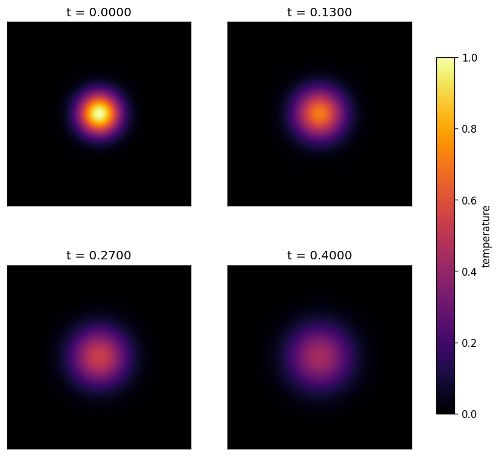

# awesome-sim

[](https://github.com/VasiliySeibert/awesome-sim/actions/workflows/ci.yml)
[](./LICENSE)
[](https://www.python.org/)

> A tiny, deliberately small, **FAIR** 2D heat-diffusion simulation —
> the running example for
> [NFDI4ING RDM Basics Lecture 4 (Research Software)](https://nfdi4ing.de/).

`awesome-sim` exists for one reason: to be **read end-to-end in a few
minutes**, so that a lecture audience can see how each
[FAIR4RS principle](https://www.rd-alliance.org/group/fair-principles-research-software-working-group)
is realised in a concrete artefact. It solves the 2D heat equation on a unit
square with Dirichlet-0 walls using an explicit finite-difference scheme. The
minimal example runs in ~1–2 minutes on a laptop and produces a heatmap
animation, a 4-panel snapshot grid, and an energy-decay plot.

## Install

From a git tag (the path we use in the lecture's Practical 3):

```bash
pip install "git+https://github.com/VasiliySeibert/awesome-sim@v1.0.0"
```

From a local clone (for development):

```bash
git clone https://github.com/VasiliySeibert/awesome-sim
cd awesome-sim
pip install -e ".[dev]"
```

## Quick start

```python
from awesome_sim import HeatDiffusion2D, animate, plot_energy_decay

sim = HeatDiffusion2D(nx=200, ny=200, alpha=1e-2, dt=5e-5)
snapshots = sim.run(n_steps=500, snapshot_every=10)
animate(snapshots, "heat.gif", fps=20)
```

Or run the full example:

```bash
python examples/minimal_example.py
# writes out/heat.gif, out/snapshots.png, out/energy_decay.png
```

## The mathematical model



*Figure: the Gaussian hot-spot diffuses radially outward; temperature at the
walls stays pinned to zero. Reproducible with
[`docs/generate_hero_image.py`](./docs/generate_hero_image.py).*

### Governing equation

`awesome-sim` integrates the **2D heat equation** (a.k.a. the linear
parabolic diffusion equation):

$$
\frac{\partial u}{\partial t}(x, y, t) \;=\; \alpha \,\nabla^{2} u(x, y, t)
\;=\; \alpha \left( \frac{\partial^{2} u}{\partial x^{2}} + \frac{\partial^{2} u}{\partial y^{2}} \right),
$$

where $u(x, y, t)$ is the temperature field and $\alpha > 0$ is the thermal
diffusivity.

### Domain and boundary conditions

The domain is the unit square $\Omega = [0, 1] \times [0, 1]$. We impose
**homogeneous Dirichlet** boundary conditions on the entire boundary
$\partial\Omega$:

$$
u(x, y, t) = 0 \quad \text{for all } (x, y) \in \partial\Omega, \; t \ge 0.
$$

Physically, the walls are held at a fixed "cold" temperature that absorbs
heat without warming up.

### Initial condition

At $t = 0$ a Gaussian hot-spot of amplitude $1$ and width $\sigma = 0.08$ is
placed at the centre of the domain $(x_0, y_0) = (0.5, 0.5)$:

$$
u(x, y, 0) \;=\; \exp\!\left( - \frac{(x - x_0)^{2} + (y - y_0)^{2}}{2\sigma^{2}} \right).
$$

### Numerical scheme

We discretise $\Omega$ with a uniform Cartesian grid of $n_x \times n_y$
nodes and spacings $\Delta x = 1/(n_x - 1)$, $\Delta y = 1/(n_y - 1)$.
Denoting $u_{i,j}^{n} \approx u(i\,\Delta x, j\,\Delta y, n\,\Delta t)$, the
Laplacian is approximated by the standard **five-point finite-difference
stencil**:

$$
\nabla^{2} u \big|_{i, j}^{n}
\;\approx\;
\frac{u_{i+1, j}^{n} - 2 u_{i, j}^{n} + u_{i-1, j}^{n}}{\Delta x^{2}}
+
\frac{u_{i, j+1}^{n} - 2 u_{i, j}^{n} + u_{i, j-1}^{n}}{\Delta y^{2}}.
$$

Time integration is an **explicit (forward) Euler** step:

$$
u_{i, j}^{n+1} \;=\; u_{i, j}^{n} + \alpha\,\Delta t\,\nabla^{2} u \big|_{i, j}^{n}.
$$

After every step the Dirichlet wall values are re-imposed.

### Stability (CFL condition)

Explicit Euler for this scheme is only **conditionally stable**. The
classical CFL-type bound for the 2D heat equation is

$$
\Delta t \;\le\; \frac{\min(\Delta x, \Delta y)^{2}}{4\,\alpha}.
$$

If you construct `HeatDiffusion2D` with a `dt` that violates this, the
solver refuses to run and raises a `ValueError` (see
[`tests/test_solver.py`](./tests/test_solver.py)::`test_cfl_violation_rejected`).

### Physical sanity check: energy decay

For the heat equation with homogeneous Dirichlet boundaries, the $L^{2}$
field energy

$$
E(t) \;=\; \int_{\Omega} u(x, y, t)^{2} \,\mathrm{d}A
$$

is **strictly non-increasing** in time (heat only leaves through the walls,
never enters). The solver records this quantity via `total_energy()`, and
one of our tests asserts that the discrete sequence $E^{0}, E^{1}, \ldots$
never increases within float-64 tolerance. This catches stability regressions
and off-by-one errors in the stencil.

### References

- Randall J. LeVeque, *Finite Difference Methods for Ordinary and Partial
  Differential Equations*, SIAM, 2007 — standard reference for the scheme
  used here.
- Lawrence C. Evans, *Partial Differential Equations*, AMS, 2010 — Chapter 2
  covers existence, uniqueness, and the energy method for the heat equation.

## How this repository maps to FAIR4RS

| Principle | Evidence here |
|-----------|---------------|
| **F1 / F1.2** persistent identifier, version IDs | git tags `v0.1.0`, `v1.0.0`; Zenodo DOIs once the GitHub↔Zenodo integration is enabled |
| **F2 / F3 / F4** rich, discoverable metadata | [`CITATION.cff`](./CITATION.cff), [`codemeta.json`](./codemeta.json), `pyproject.toml`, this README |
| **A1 / A1.1** open retrieval | public GitHub over HTTPS, `pip install git+…` |
| **A1.2** auth where needed | only for private forks (PAT); this repo is public |
| **A2** metadata persists | Zenodo deposit + [Software Heritage](https://archive.softwareheritage.org/) archive |
| **I1 / I2** standards, qualified refs | JSON-LD metadata, SPDX license id, ORCID-qualified authorship, pinned dependencies |
| **R1.1** clear license | [`LICENSE`](./LICENSE) (SPDX: `MIT`) |
| **R1.2** provenance | git history + [`CHANGELOG.md`](./CHANGELOG.md) |
| **R2** qualified refs to other software | version-pinned `dependencies` in [`pyproject.toml`](./pyproject.toml) |
| **R3** community standards | PEP 621, CFF 1.2.0, CodeMeta 2.0, GitHub Actions CI |

## Repository layout

```
awesome-sim/
├── README.md                 # you are here
├── LICENSE                   # MIT
├── CITATION.cff              # how to cite
├── codemeta.json             # JSON-LD metadata
├── pyproject.toml            # build + pinned deps
├── CHANGELOG.md              # versioned provenance
├── .github/workflows/ci.yml  # automated build + test
├── docs/
│   ├── snapshots.png         # README hero image
│   └── generate_hero_image.py# reproduces it
├── src/awesome_sim/          # the package
│   ├── solver.py             # 2D heat FD solver
│   └── viz.py                # matplotlib helpers
├── examples/
│   └── minimal_example.py    # 1–2 minute runnable demo
└── tests/                    # smoke + energy-decay checks
```

## Citing this software

See [`CITATION.cff`](./CITATION.cff) — GitHub renders a "Cite this
repository" button on the sidebar that reads this file. Once the Zenodo
deposit exists, the file includes the version DOI as well.

## License

`awesome-sim` is released under the [MIT License](./LICENSE) — SPDX
identifier `MIT`.

## Acknowledgement

Developed for NFDI4ING, RDM Basics lecture series, by Vasiliy Seibert
([ORCID](https://orcid.org/0000-0002-7121-6816), TU Clausthal).
